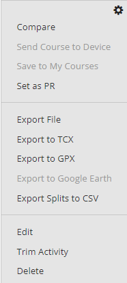
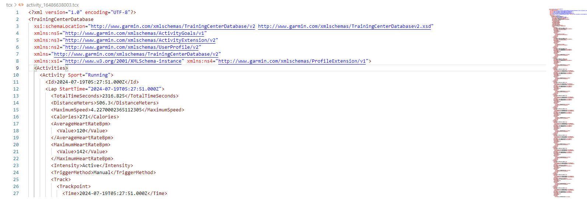
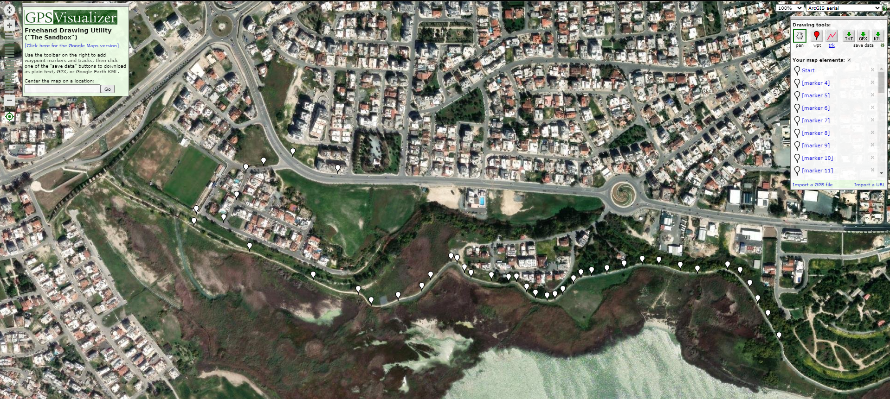
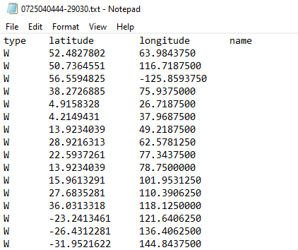
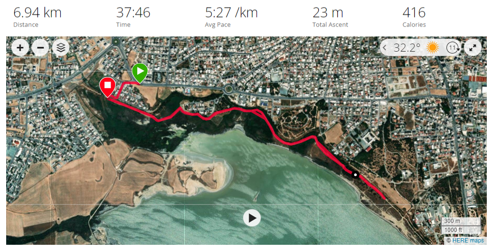

# How I Adjusted Garmin GPS Coordinates using Python

Welcome! The following document contains the details a small project working with XML, Interpolation, and python scripts. Find out how I used Python to solve a real-world problem related to my Gamrin Multisport GPS Watch and how the implications of the Isreal-Palistine conflict incentivised some deeper learning of 3 Python Libraries. 

# Document Contents 

- [**Introduction**](#Introduction): Provides context to the problem. Reveals the requirements for a solution. 

# Introduction 

To provide some context, since a child I've relished in a variety of sports and as I've grown to become young adult I've maintained that same keen interest. Over the years, what started out as an enjoyable pass-time, expanded to become one of my core values and a contribution to my overall wellbeing and health. My most recent focus is an exercise that some may see as burdensome, albeit challenging at times I see it as an healthy escape from the hustle and bustle of life, and its an excercise that I can only regard as a classic, that is, the art of running. It's a form birthed at childhood that we all know too well, its beauty lies in its simplicity. Putting one foot in front of the other, we experience one our most natural movements, it's needless to say running is among the best investments one can make for their body and mind. As with most of my hobbies, I found great joy in quantifying my progress and seeking ways to improve my ability level. Heartrate and Distance were metrics I soon began to observe. This was made easy by utilizing Garmin's Fenix Multisport GPS watch and their accompanying platform Garmin Connect. The Fenix encompasses a broad range of features and capabilities, all aimed at measuring essential workout metrics, including Heart-Rate Monitoring, GPS tracking, recovery insights and much more. Garmin connect on the other hand, is a platform capable for holding data and providing a holistic overwiew of progress through an intuituve interface, its main uses include visualising the geographical rounts taken and gaining valuable insight through workout monitoring.

It's a great watch and I love the ergonomical design, however there was a giant issue that I soon encountered. The GPS produced perculiar results. Not only was the map visual misaligned, the distance metric was incorrect. Was something wrong with the Garmin Watch? No, and I wasn't suprised. It will come at no shock to those who have travelled through the Mediterranean, Baltic, and Middle-Eastern regions that these results are no fault of brand or model. The problem I faced stems from a much deeper issue: electronic warfare and our spatial proximity to the Middle-Eastern region. The geopolitical conflict in this area has resulted in GPS and satellite signal disruptions, many areas of life are being affected. To list a few: flight navigation and air traffic control are having to revert to to traditional navigation methods, costing time and money; delays are being experienced by emergency serives such as ambulances, police and fire-services; these are all underpinned by the finacial impact and psycological strain being caused to relevent industries and public confidence. I bring forward my experience within this document not to diminish that of what is going on around us, but instead to bring light to a comparitively small, yet very real conscequence of the ongoing conflict. With that being said, I was determined to reconcile the problem I was facing. 


## Initial problem solving

Due to the GPS interference, the incorrect coordinates it produced had serveral implications; 

1) First, an inaccuracy of distance, Example: A 10k run may show up as 7k or at times even 0.7k. 

2) Second, skewed variables rendered Garmin Connect and gaining insights through it, ineffective; and the accumulated data that leads to fitness progression insight, virtually non-existant. 

3) Lastly the maps looked choatic, much like if you employed a toddler to draw their finest scribble on a map, this debilitates ones aptitude to visualise their run in the intended manner. 

Heres an example: 


Being unable to view a map of the route taken in your run admittedly is annoying, but of the three issues at hand, you may say it falls last in priority. If that is the case, I agree with you, however at the time of conducting this project, I was baring the afterglow of a beautiful morning run, edorphins and adreneline were pumping through my vains, logic had taken the backseat, the lack of a simple yet playful visual displaying my overhead route was not just an inconvenience, it was a cry for help! Determined to be deprived no longer, I fired up my laptop, opened my IDE, and got to work, to me issue 3 was of paramount importance.


## Thought process No1

Can I manually adjust the map, in a drag and drop fashion - similiar to https://onthegomap.com/#/create 's 'how far did I run?' - to fix all these issues? Unfortunatly adjusting the coordinates in this way, is not supported by garmin directly, I even attempted to use Golden Cheetah with no success. Yet effort to resolve my issue in this way did not go to waste, as it was through the process of downloading the workout data from garmin - in order to upload it to the Golden Cheeter application - that I discovered Garmin's XML equivalent file type, TCX (Training Center XML). 

Garmins Available File Formats for Download: 



## Thought Process No2

My new goal was simple, download the xml file and find the affected data points, create data that reflects the corrected coordinates, re-upload. Simple enough? It then dawned on me, with 1000s of data points to adjust, doing this line by line would be tedious and not worth the effort. But, I had a great idea! A Python script could make short work of the repititious task. 

// I knew I could easily enough go into the file, plug in the right coordinates, and re-upload the file to garmin, I just had to adapt there were 1000s of records to change. But, I had a great idea! A Python script could make short work of the repititious task. 

// Searching  with the knowledge that garmin stores their data in a tcx file (a type of xml) repairing this deta in the source file manually seemed to be the most viable option, but with 1000s of data points to adjust doing this line by line would be tedious and big word. Insert python. 

// As it turns out, the workout data could be remediated by accessing and adapting the corresponding TCX - Training Center XML - file. My goal was simple, download the xml file and find the affected tackpoints, create data that reflects true to facts coordinates, reupload, enjoy. Simple enough. 


To give you an idea of what the file looks like, here is as snippet: 



## Creating Replacement Data

Before moving onto the main script, I needed to prepare the replacement data. This meant finding the coordinates of my run. For this I used https://www.gpsvisualizer.com/draw/, dropping pins at the disired location was quick and easy, after that, the corresponding coordinates could be saved to a txt file.

Here is an example of me dropping some pins:


This is an example of what some of the downloaded cordinates look like:


## Automated Coordinate Generator

As distinct from a circular route, the run followed what you wouuld call an out-and-back route, starting from a desired location, travelling to a midway checkpoint, followed by retracing your steps and eventually finishing where you started. Therefore my data points only represented half of the route and I had to add a reversed set of the coordinates to the end. To save time I used python. To view the code in its entirety click - or right click to open tab - the following link: 

The following is a Portion of the File with Narritive Comments:

```python
# Define input and output file names
input_file = 'input.txt'
output_file = 'output_combined.txt'

# Read the input file with tabs as delimiter
with open(input_file, 'r', newline='') as infile:
    reader = csv.DictReader(infile, delimiter='\t')
    rows = list(reader)  # Convert to a list to enable processing

# Reverse the order of the rows and combine with the original list
reversed_rows = rows[::-1]
combined_rows = rows + reversed_rows

# Write the combined rows to the output file
with open(output_file, 'w', newline='') as outfile:
    writer = csv.DictWriter(outfile, fieldnames=reader.fieldnames, delimiter='\t')
    writer.writeheader()  
    writer.writerows(combined_rows) 

print(f"Combined original and reversed records written to {output_file}")
```

## A Mismatch in Data Points

With my Out and Back Coordinates saved in a handy Tab-Separated-Value file I was almost ready to start replacing my TCX File coordinates. However there was one small discrepency. When plannning my route and extracting the corrected cordinates, I simply droped markers at every turning point and took little notice to the distances between each marker, additionally the total number of paired Latitude and Longitude coordinates - including the reversed set - amounted to 87. The discrepency appears once you consider, during a workout a Garmin watch records data every second, with each second represented as a single Trackpoint within a TCX file. In consequence a thirty minute workout produces 1800 Trackpoints. Since each trackpoint contains metrics like Distance, Latitude, and Longitude; and every Trackpoint needed modification, I had to interpolate my 87 coordinates. 

I will not cover the Code I used to calculate the number of Trackpoints within a TCX in the document, however if you would like to view the Python script click - right click to open in new tab - this link: [Count Trackpoints Code](src/count-trackpoints.py)


## Interpolation

In order to interpolate the newly generated precise coordinates - so they amount to the sum total trackpoints (measured in the previous script) - and to ensure they are equally spaced, I used the following python script. To view the code in its entirety click the link: 

Here is a higher-level overview with narritive comments:

```python 
import pandas as pd
import numpy as np
from geopy.distance import geodesic # Note the geodesic module import from library geopy.distance, for the purpose of calculating distances. 
from pathlib import Path

# Below are the functions that were defined. 

# Calculate the total distance traveled.
def calculate_total_distance(coords):

# Resample the data to total trackpoints, equally spaced apart.
def resample_coordinates(coords, num_points):

# Format the coordinates to the specified number of decimal places. Important for reliability.
def format_coordinates(coords, decimal_places, for_dist):


# Below we run the functions with our desired inputs.

# Resample coordinates to total trackpoints
resampled_coords = resample_coordinates(coords, 1800)

# Format the resampled coordinates to 7 decimal places. This maintains Garmins Standard.
formatted_coords = format_coordinates(resampled_coords, 15, 14)

# Save the resampled coordinates to a new file
resampled_data = pd.DataFrame(formatted_coords, columns=['latitude', 'longitude', 'distance_meters'])
resampled_data.to_csv(folder / 'resampled_coordinates.txt', index=False, sep='\t')
```

## Parse and Replace

At this point, I have my /Data/resampled_coordinates.txt file - a TSV file containing 1800 equally distanced coordinates - accurately representing my morning-run. All I had to do, was parse the original TCX file and replace each Latitude, Longitude, and DistanceMeters variable. To acheive this, I used the following Python code. Click the link to view it in its entirety: 

Here is a higher-level overview with narritive comments:

```python
# Import Libaries***

# Load the resampled coordinates***

# Parse the TCX file
tcx_file_path = Path('tcx') / 'activity_16486638003.tcx'
tree = ET.parse(tcx_file_path)
root = tree.getroot()

# Define namespaces
namespaces = {
    'tcx': 'http://www.garmin.com/xmlschemas/TrainingCenterDatabase/v2'
}
# Find all Trackpoints
trackpoints = root.findall('.//tcx:Trackpoint', namespaces)

# Replace latitude, longitude, and distance values
for i, trackpoint in enumerate(trackpoints):
    # code continues

# Save the modified TCX file
modified_tcx_file_path = tcx_file_path = Path('tcx') / 'modified_file.tcx'

# Maintain TCX format identical to original. Ensures the file is supported by Garmin Connect
tree.write(modified_tcx_file_path, xml_declaration=True, encoding='UTF-8', pretty_print=True)
```


## Final Product

With the implementation of the previous step, my newly created TCX file - /tcx/modified_file.tcx - was ready to be uploaded to Garmin Connect!

Here is the Result:



## Limitations

Although this is a decent work around for GPS disruptions affecting Garmin measurements, I thought it was best to mention that this is by no means a perfect solution. When inerpolating our new coordinates I casually brushed past the fact that this system equally spaces the distance of each data point. No race is run at an invariable pace, therefore the various metrics can not perfectly align with its corresponding location perfectly. There are ways of eliminating inconsitences however, such as using checkpoints to compartmentilise (segment?) the followed course, or using Garmin's non-GPS in built distance and pace measurements to calculate distances, providing a far more realistic distrubution. This will be discussed further in the future work section, aimed at improving the accuracy of this system. 


## Summary 

From what started out as a poor endorsememt unjustly sewn against Garmin products (I still love their watches), to conflict driven ripple-affect felt globaly, this small project provided an opportunity for deeper learning. By utilising libraries: geopy, pandas, and lxml; this system provides a viable solution to a real-life problem. We created new data, resampling it to the desired sum total and appropriately formatting; next we modified an existing TCX file, adapting several data points using our new data; the end result produced a accurate rendering of the workout activity, hosted on Garmin Connect. The process of creating such a system also demonstrates the versitility of python and its supporting libraries, viable for numerous tasks and processes. My personal growth manifests itself in deeper understanding of XLM files, GPS coodinates + supporting library geopy, and resampling methods. Going forward, whether facing industry specific or personal obstacles, I hope this project serves as a reminder to myself and similiar others that Python has great potential for improving workflows and everyday life. 


## Conclusion

Thank you for reading this document! It was an enjoyable experience creating this system, I hope you can take away some value from it. I learnt a lot from the process, so at I least hope it encourages you to try coding something new. If you do, share it with me! Lastly, any feedback is welcome, my contacts are below. Thank you again and I will see you guys in the next one! Have a great weekend!


## Future Work

To enhance the accuracy of the system and address the limitations mentioned, future work will focus on implementing several key improvements. One such enhancement is the incorporation of checkpoints to segment the course, which will help mitigate inconsistencies by providing more precise reference points. Additionally, leveraging Garmin's non-GPS built-in distance and pace measurements will allow for a more realistic distribution of data points, aligning better with the actual run dynamics.

**New Project Ideas:**
1) Adaptive Interpolation Algorithm:
Develop an adaptive algorithm that dynamically adjusts interpolation based on pace variability detected from non-GPS sensors.

2) Machine Learning for GPS Anomaly Correction:
Integrate machine learning techniques to predict and correct GPS anomalies, offering a more robust solution for accurate race tracking.

### Licence

This project is licensed under the MIT License - see the  file for details.

### Contact Information

If you have any questions or comments about the project, or if you're interested in contributing, feel free to reach out:

- **Project Maintainer**: Emilios Richards
- **Email**: emiliosmrichards@gmail.com
- **GitHub Profile**: [EmiliosRichards](https://github.com/EmiliosRichards)

